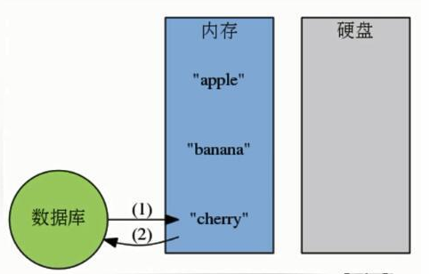
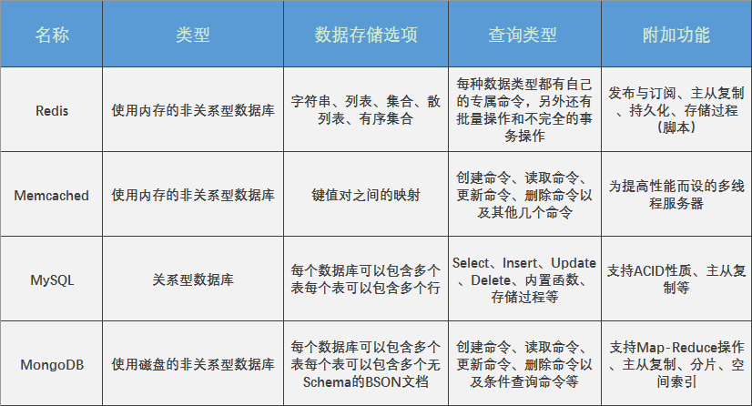

## Redis是什么？
Redis是一个使用C编写的开源、支持网络、基于内存、可选持久性的键值对存储数据库。

#### 网络层
客户端和服务器通过 TCP 连接来进行数据交互， 服务器默认的端口号为 6379 。
客户端和服务器发送的命令或数据一律以 \r\n （CRLF）结尾。

#### 基于内存
数据库的工作模式按存储方式可分为：硬盘数据库和内存数据库。Redis将数据储存在内存里面，读写数据的时候都不会受到硬盘 I/O 速度的限制，所以速度极快。

硬盘数据库的工作模式：  

内存数据库的工作模式：  

#### 持久化
Redis通常将全部的数据存储在内存中。2.4版本后可配置为使用虚拟内存，一部分数据集存储在硬盘上，但这个特性废弃了。

目前通过两种方式实现持久化：
- RDB 将数据库的快照（snapshot）以二进制的方式保存到磁盘中。rdb 是某一个时刻的内存镜像数据写入到磁盘文件，之后的写入数据会丢失。 rdb 持久化方式的优点是持久化后的文件比较小(只有某一个时刻的数据且会压缩)，实例重启时加载会更快。缺点是如果实例重启，备份时刻之后的写入数据会丢失。

- （日志）AOF 则以协议文本的方式，将所有对数据库进行过写入的命令（及其参数）记录到 AOF 文件，以此达到记录数据库状态的目的。 
方式：
appendfsync = always 每条写入都会刷盘, 最多只会丢失当前正在写入的命令
appendfsync = everysec 每秒刷一次盘, 最多丢失一秒的数据
appendfsync = no 不显式刷盘。注意不是不刷盘而是由操作系统来决定何时刷盘(linux 貌似大部分默认是 30s)。可能会丢失刷盘之前的写入数据。

#### 数据结构
它支持多种类型的数据结构，如字符串（String），散列（Hash），列表（List），集合（Set），有序集合（Sorted Set或者是ZSet）与范围查询，Bitmaps，Hyperloglogs 和地理空间（Geospatial）索引半径查询。其中常见的数据结构类型有：String、List、Set、Hash、ZSet这5种。

## Redis和其他数据库的区别

